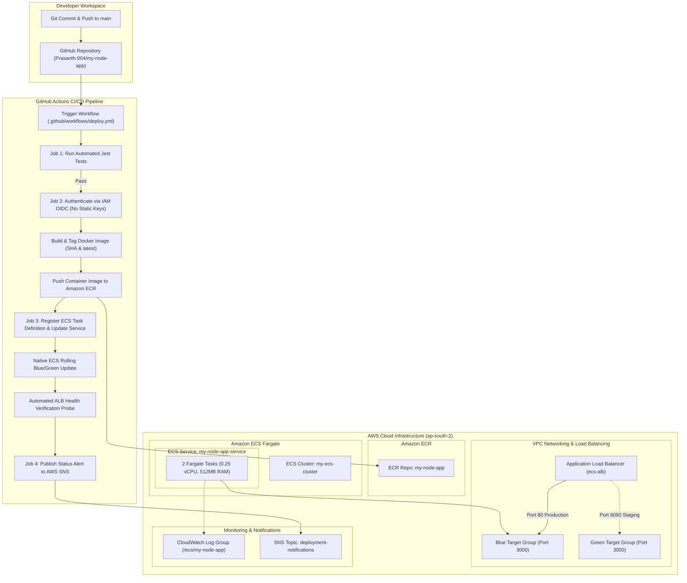

# 🚀 Production-Grade AWS ECS Fargate CI/CD Pipeline


A production-grade, zero-downtime automated CI/CD pipeline deploying containerized Node.js microservices to **Amazon ECS Fargate** using **Native Blue/Green Rolling Deployments**, OpenID Connect (**OIDC**) federated authentication, **Amazon ECR**, **Application Load Balancing (ALB)**, **CloudWatch Logs**, and **AWS SNS Notifications**.

---

## 🏛️ Master Architecture Diagram



---

## 🌟 Key Features & Enterprise Best Practices

- **Zero-Downtime Native Blue/Green Deployments**: Uses ECS rolling deployment controller (`minimumHealthyPercent=100`, `maximumPercent=200`) bound to dual ALB target groups (`blue-target-group` and `green-target-group`).
- **Zero Static Credentials (OIDC Federation)**: GitHub Actions authenticates to AWS STS using OpenID Connect (`aws-actions/configure-aws-credentials@v4`) and short-lived session tokens scoped strictly to `repo:Prasanth-004/my-node-app:*`.
- **Production-Hardened Docker Security**: Built on `node:18-alpine` executing as non-root unprivileged user `nodejs`, reducing container attack surface and containing kernel namespace privileges.
- **Automated Quality Guardrails**: Integrated Jest test suite (`app.test.js`) enforcing 100% pass rates on API endpoints before container image compilation.
- **Real-Time Observability & Alerts**: Centralized container logging in CloudWatch (`/ecs/my-node-app`) and automated deployment notifications sent via Amazon SNS (`deployment-notifications`).

---

## 📂 Repository Structure

```text
.
├── .github/
│   └── workflows/
│       └── deploy.yml              # Production GitHub Actions Pipeline Definition
├── iam/
│   ├── github-oidc-trust-policy.json # IAM OIDC Trust Policy
│   ├── GitHubECRPolicy.json        # ECR Push & Auth Policy
│   ├── GitHubECSPolicy.json        # ECS Deployment & SNS Policy
│   └── GitHubPassRolePolicy.json   # IAM PassRole Policy
├── app.js                          # Express.js Microservice Server & REST Endpoints
├── app.test.js                     # Jest Integration Test Suite
├── Dockerfile                      # Hardened Multi-Stage Dockerfile (Non-root user)
├── .dockerignore                   # Docker Build Context Exclusions
├── package.json                    # Node.js Manifest & Test Scripts
└── taskdef.json                    # ECS Task Definition Blueprint
```

---

## 🔧 AWS Infrastructure Specifications

| Infrastructure Component | Resource Name / Identifier | Region |
| :--- | :--- | :--- |
| **AWS Region** | `ap-south-2` (Asia Pacific - Hyderabad) | `ap-south-2` |
| **AWS Account ID** | `351682129477` | |
| **Amazon ECR Repository** | `my-node-app` | `ap-south-2` |
| **Application Load Balancer** | `ecs-alb` | `ap-south-2` |
| **ALB Security Group** | `ecs-alb-sg` (`sg-0012aaabd9c497a1b`) | `ap-south-2` |
| **Blue Target Group** | `blue-target-group` (Port 3000, `/health`) | `ap-south-2` |
| **Green Target Group** | `green-target-group` (Port 3000, `/health`) | `ap-south-2` |
| **Amazon ECS Cluster** | `my-ecs-cluster` (AWS Fargate) | `ap-south-2` |
| **Amazon ECS Service** | `my-node-app-service` (2 Desired Tasks) | `ap-south-2` |
| **CloudWatch Log Group** | `/ecs/my-node-app` | `ap-south-2` |
| **Amazon SNS Topic** | `deployment-notifications` | `ap-south-2` |

---

## 🧪 Local Testing & Development

### 1. Install Dependencies
```bash
npm install
```

### 2. Run Test Suite
```bash
npm test
```

### 3. Start Local Server
```bash
npm start
```

### 4. Test Local Endpoints
```bash
curl http://localhost:3000/
curl http://localhost:3000/health
curl http://localhost:3000/api/users
```

---

## 🌐 Live Production Endpoints

- 🚀 **Live Production API**: [http://ecs-alb-708781990.ap-south-2.elb.amazonaws.com](http://ecs-alb-708781990.ap-south-2.elb.amazonaws.com)
- 🏥 **Health Check Endpoint**: [http://ecs-alb-708781990.ap-south-2.elb.amazonaws.com/health](http://ecs-alb-708781990.ap-south-2.elb.amazonaws.com/health)
- 👥 **Users API Endpoint**: [http://ecs-alb-708781990.ap-south-2.elb.amazonaws.com/api/users](http://ecs-alb-708781990.ap-south-2.elb.amazonaws.com/api/users)

---

## 👥 Authors & Team

- **Prasanth**
- **Yashu**
